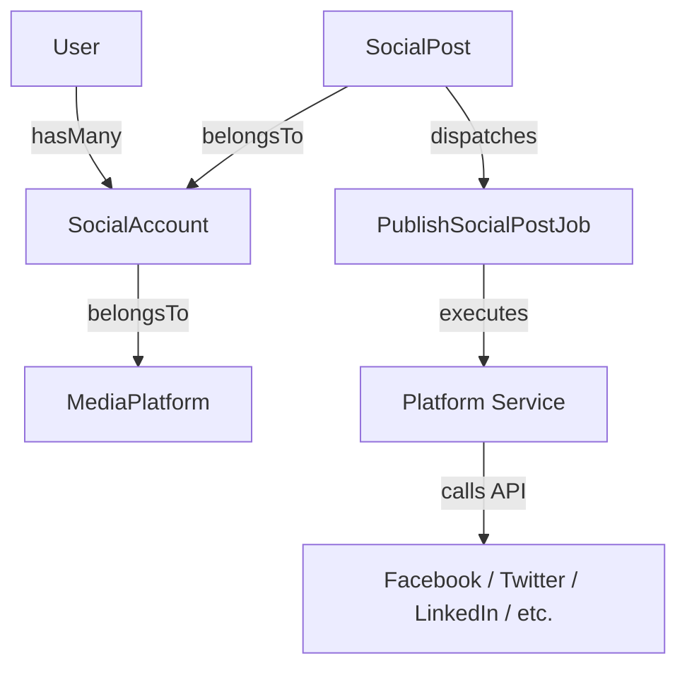

# BeePost Social Poster Package

[](https://packagist.org/packages/beepost/social-poster)
[](https://packagist.org/packages/beepost/social-poster)
[](https://github.com/beepost/social-poster/actions)

A reusable Laravel package for managing social media account connections and posting to popular platforms including **Facebook**, **Instagram**, **Twitter/X**, **LinkedIn**, **Threads**, **TikTok**, and **YouTube**.

## Why BeePost Exists

Unlike simple posting packages, BeePost Social Poster provides a complete, production-ready framework for multi-platform publishing. It is built to satisfy SaaS, multi-tenant, and complex application architectures by handling:

- **Account Management**: Seamlessly connect, query, and verify platform status.
- **Out-of-the-Box OAuth Integrations**: Pre-built OAuth2/PKCE flows for major social platforms.
- **Secure Token Storage**: Automatically encrypts client credentials, access tokens, and refresh tokens in your database.
- **Post Persistence**: Dedicated models to log, track, and monitor social posts.
- **Queue Processing**: Native integration with Laravel's queue worker for robust background publishing.
- **Event-Driven Workflows**: Fully decoupled dispatching allows customization of file handling, analytics tracking, and notification layers.

---

## Supported Features Matrix

| Platform | OAuth | Text | Image | Video |
| :--- | :---: | :---: | :---: | :---: |
| **Facebook** | ✅ | ✅ | ✅ | ✅ |
| **Instagram** | ✅ | ✅ | ✅ | ✅ |
| **Twitter/X** | ✅ | ✅ | ✅ | ⚠️ |
| **LinkedIn** | ✅ | ✅ | ✅ | ✅ |
| **TikTok** | ✅ | ❌ | ❌ | ✅ |
| **YouTube** | ✅ | ❌ | ❌ | ✅ |
| **Threads** | ✅ | ✅ | ✅ | ⚠️ |

---

## Architecture Flow



---

## Package Structure

```
src/
├── Contracts/
│   └── PlatformAccountInterface.php
├── Enums/
│   ├── PlanDuration.php
│   ├── PostScheduleStatus.php
│   └── StatusEnum.php
├── Events/
│   ├── SocialAccountCreated.php
│   └── SocialPostCreated.php
├── Jobs/
│   └── PublishSocialPostJob.php
├── Models/
│   ├── SocialAccount.php
│   └── SocialPost.php
├── Services/
│   └── Account/
│       ├── facebook/
│       ├── instagram/
│       ├── linkedin/
│       ├── threads/
│       ├── tiktok/
│       ├── twitter/
│       └── youtube/
├── Traits/
│   ├── AccountManager.php
│   └── PostManager.php
├── helpers.php
└── SocialPosterServiceProvider.php
```

---

## Installation

### 1. Require the Package

Install the package via Composer:

```bash
composer require beepost/social-poster
```

#### Local Development
If you are developing locally or referencing a private repository, define the package path in your host application's `composer.json` before requiring it:

```json
"repositories": [
    {
        "type": "path",
        "url": "packages/beepost/social-poster"
    }
]
```

### 2. Publish Configuration & Migrations

Publish the package configuration:

```bash
php artisan vendor:publish --provider="BeePost\SocialPoster\SocialPosterServiceProvider" --tag="config"
```

Publish the database migrations:

```bash
php artisan vendor:publish --provider="BeePost\SocialPoster\SocialPosterServiceProvider" --tag="migrations"
```

### 3. Run Migrations

Create the required database tables (`media_platforms`, `social_accounts`, and `social_posts`):

```bash
php artisan migrate
```

---

## Configuration

The published config file is located at `config/social-poster.php`. Override default models to fit your host application:

```php
return [
    /*
    |--------------------------------------------------------------------------
    | Model Mapping
    |--------------------------------------------------------------------------
    | Define the Eloquent models used by your host application.
    */
    'models' => [
        'user'         => \App\Models\User::class,
        'admin'        => \App\Models\Admin::class,
        'file'         => \App\Models\Core\File::class,
        'platform'     => \App\Models\MediaPlatform::class,
        'subscription' => \App\Models\Subscription::class,
        'metric'       => \App\Models\PostMetric::class,
    ],

    /*
    |--------------------------------------------------------------------------
    | Queue Settings
    |--------------------------------------------------------------------------
    | Specify whether posting should be run synchronously or queued.
    */
    'queue' => [
        'enabled' => true,
        'name'    => 'social-poster',
    ],

    /*
    |--------------------------------------------------------------------------
    | Storage Settings
    |--------------------------------------------------------------------------
    | Path to store media or configuration cache relative to storage root.
    */
    'file_path' => 'social-poster',
];
```

---

## Supported Platforms & OAuth Credentials

Add the credentials for each social media provider to your host application's `.env` file:

```env
# Facebook & Instagram Graph API
FACEBOOK_CLIENT_ID=your_client_id
FACEBOOK_CLIENT_SECRET=your_client_secret
FACEBOOK_REDIRECT_URI="${APP_URL}/social/facebook/callback"

# Twitter/X API v2 (OAuth 2.0 PKCE)
TWITTER_CLIENT_ID=your_client_id
TWITTER_CLIENT_SECRET=your_client_secret
TWITTER_REDIRECT_URI="${APP_URL}/social/twitter/callback"

# LinkedIn OAuth 2.0
LINKEDIN_CLIENT_ID=your_client_id
LINKEDIN_CLIENT_SECRET=your_client_secret
LINKEDIN_REDIRECT_URI="${APP_URL}/social/linkedin/callback"

# YouTube (Google OAuth 2.0)
YOUTUBE_CLIENT_ID=your_client_id
YOUTUBE_CLIENT_SECRET=your_client_secret
YOUTUBE_REDIRECT_URI="${APP_URL}/social/youtube/callback"

# TikTok API
TIKTOK_CLIENT_KEY=your_client_key
TIKTOK_CLIENT_SECRET=your_client_secret
TIKTOK_REDIRECT_URI="${APP_URL}/social/tiktok/callback"
```

---

## OAuth & Connection Flow

All platform account services implement `BeePost\SocialPoster\Contracts\PlatformAccountInterface`.

### Step 1: Redirecting to Provider
Initiate authorization flows using the respective platform service. For example, using the Twitter/X PKCE flow:

```php
use BeePost\SocialPoster\Services\Account\twitter\Account as TwitterAccount;
use BeePost\SocialPoster\Models\MediaPlatform;
use Illuminate\Http\Request;

class OAuthController extends Controller
{
    public function redirectToTwitter(Request $request)
    {
        $platform = MediaPlatform::where('slug', 'twitter')->firstOrFail();
        $twitterService = app(TwitterAccount::class);

        // Generates secure state, PKCE verifiers, caches them, and returns authorization URL.
        $url = $twitterService->redirectToConnect($platform);

        return redirect()->away($url);
    }
}
```

### Step 2: Handling Callback
Handle callback parameters from the OAuth provider inside your callback handler:

```php
    public function handleTwitterCallback(Request $request)
    {
        $platform = MediaPlatform::where('slug', 'twitter')->firstOrFail();
        $twitterService = app(TwitterAccount::class);

        // Authenticates code against cached verifiers
        $response = $twitterService->connect($platform, $request->all());

        if ($response['status'] === 'success') {
            // Save the connected social account
            $account = SocialAccount::create([
                'platform_id'         => $platform->id,
                'user_id'             => auth()->id(),
                'name'                => $response['account_name'],
                'account_information' => $response['account_information'], // Cast automatically encrypts
                'token'               => $response['token'],               // Cast automatically encrypts
                'refresh_token'       => $response['refresh_token'] ?? null, // Cast automatically encrypts
                'status'              => '1',
                'is_connected'        => '1',
            ]);

            return redirect()->route('dashboard')->with('success', 'Twitter connected!');
        }

        return redirect()->route('dashboard')->with('error', $response['message']);
    }
```

---

## Event Documentation

The package dispatches events during core actions to stay decoupled from host applications:

### 1. `SocialAccountCreated`
Fired immediately after an account is successfully linked and saved.
* **Payload**: `BeePost\SocialPoster\Events\SocialAccountCreated`
* **Properties**:
  - `$account`: The `SocialAccount` model instance.
  - `$platform`: The related `MediaPlatform` model instance.

### 2. `SocialPostCreated`
Fired right after post models are created, allowing host applications to process billing, credits, or log telemetry.
* **Payload**: `BeePost\SocialPoster\Events\SocialPostCreated`
* **Properties**:
  - `$postsCreated`: Array of `SocialPost` model instances.
  - `$totalPost`: Total count of posts created.
  - `$user`: The owner user instance (or null if admin post).
  - `$admin`: The owner admin instance (or null if user post).

> [!NOTE]
> To avoid serialization exceptions on non-serializable objects (like `Illuminate\Http\UploadedFile`), file attachments are not passed inside the event payload. Developers should handle file uploads and storage in their service or controller before invoking `savePost()`, or query files directly from the request context in synchronous listeners.

#### Custom Event Listener Example:
```php
namespace App\Listeners;

use BeePost\SocialPoster\Events\SocialPostCreated;

class HandleSocialPostCreatedTelemetry
{
    public function handle(SocialPostCreated $event)
    {
        $owner = $event->user ?? $event->admin;
        
        // Deduct posting credits or update log tables
        $owner->decrement('credits', $event->accountsCount);
    }
}
```

---

## Queue & Asynchronous Posting

Posting to social networks synchronously in the request cycle can trigger timeout issues. The package provides a queueable job, `PublishSocialPostJob`.

### Dispatching the Job

When a post is scheduled or created:

```php
use BeePost\SocialPoster\Jobs\PublishSocialPostJob;

// Inside your Controller or PostManager trait usage:
foreach ($postsCreated as $post) {
    if (config('social-poster.queue.enabled')) {
        PublishSocialPostJob::dispatch($post)
            ->onQueue(config('social-poster.queue.name'));
    } else {
        // Fallback to synchronous publishing
        app(PostManager::class)->publishPost($post);
    }
}
```

### Job Configurations

The `PublishSocialPostJob` incorporates:
- **Tries**: 3 attempts.
- **Backoff**: Exponential backoff (delaying 10, 20, then 40 seconds on subsequent failures).
- **Exceptions**: Gracefully handles network and API errors.

Ensure your queue worker is running:
```bash
php artisan queue:work --queue=social-poster
```

---

## Helper Wrapper Functions

The package exposes helper functions registered in `src/helpers.php`:

- `social_poster_trans($key, $replace = [])`: Translation wrapper falling back to the package trans string or host localization files.
- `social_poster_response_status($status)`: Resolves default responses and response structures for account connection requests.

---

## Testing

Run tests with **Pest PHP**:

```bash
vendor/bin/pest
```

---

## License

The MIT License (MIT). Please see [License File](LICENSE.md) for more information.
